# Tugas Praktikum Pemrograman Web

#### Menjalankan Web Server

# 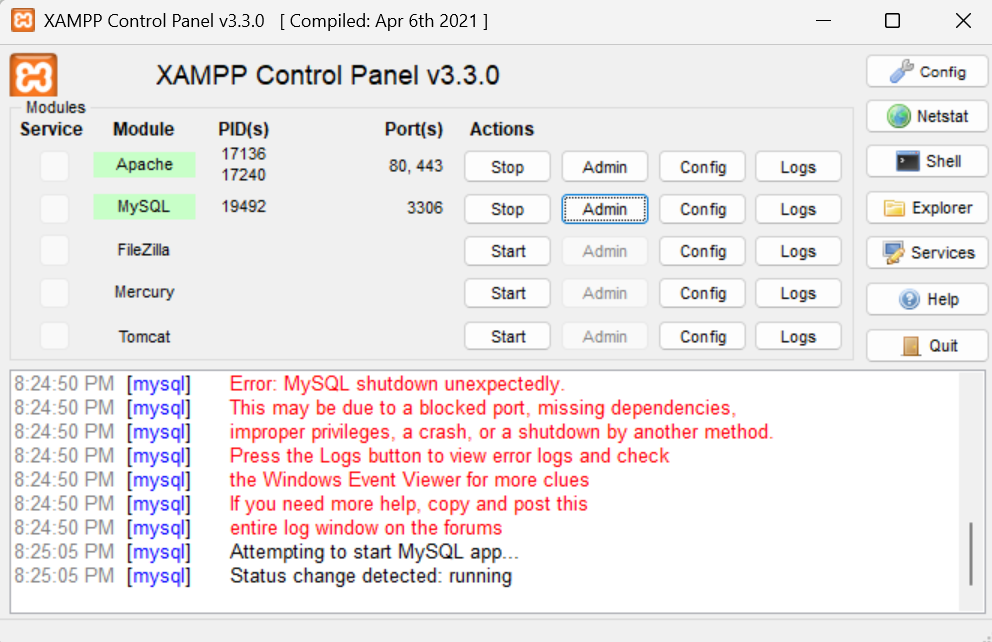

#### Buat file baru dengan nama mobil.php

# 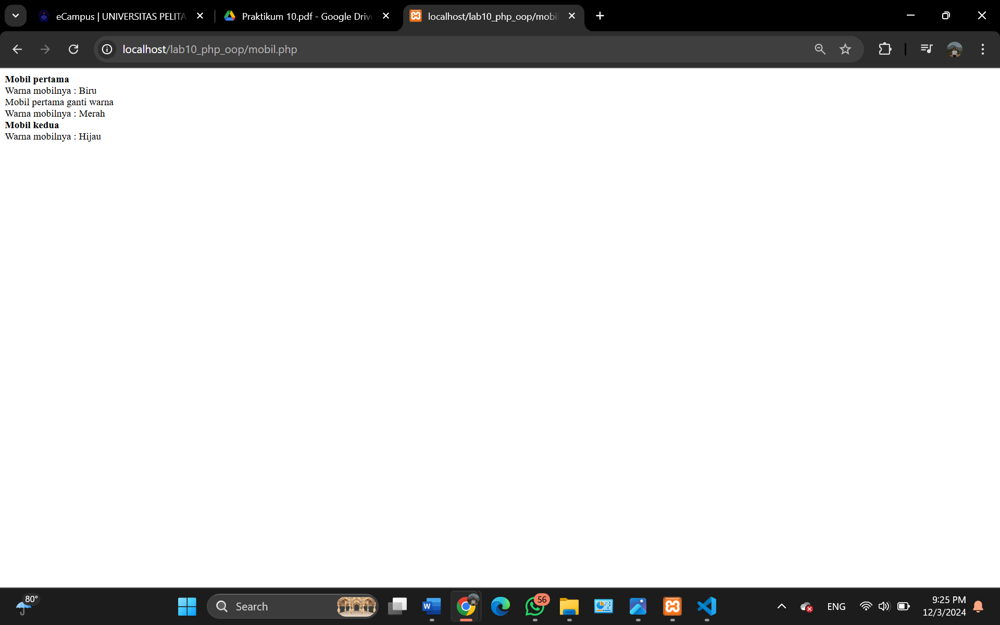

## Pertanyaan dan Tugas
Implementasikan konsep modularisasi pada kode program pada praktukum sebelumnya
dengan menggunakan class library untuk form dan database connection.

####  Buat file baru bernama form.php untuk menyimpan class Form

# 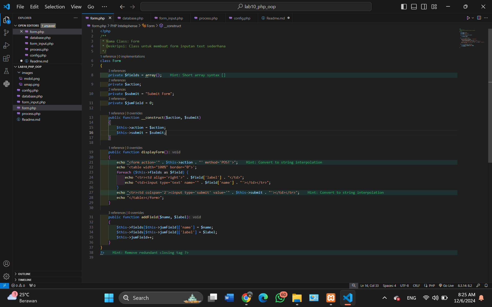

####  Buat file baru bernama database.php untuk menyimpan class Database

# 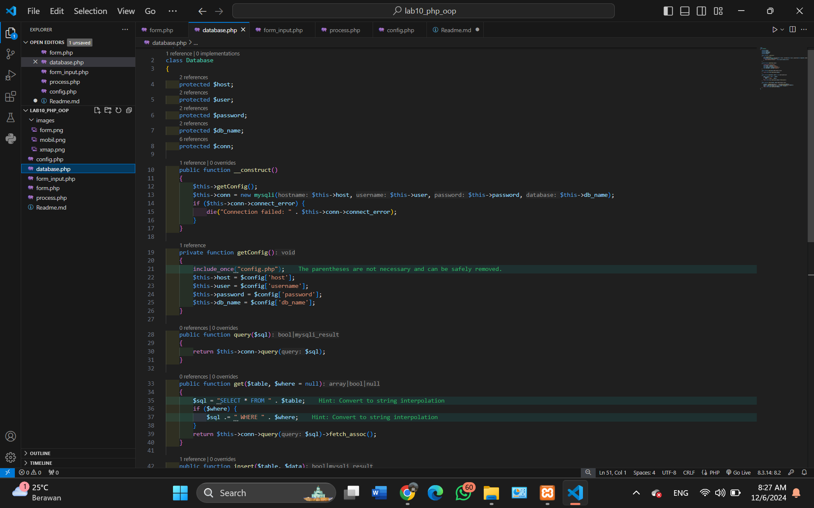

#### Buat file form_input.php untuk menggunakan class Form dan Database

# 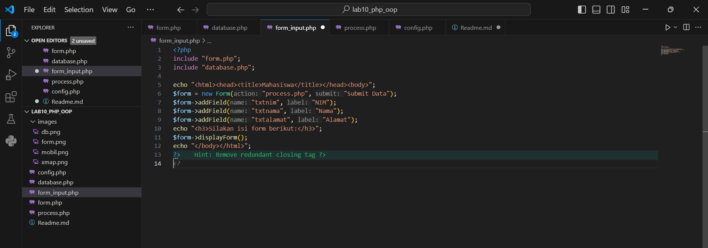

#### Buat file process.php untuk memproses data form dan menyimpannya ke database

# 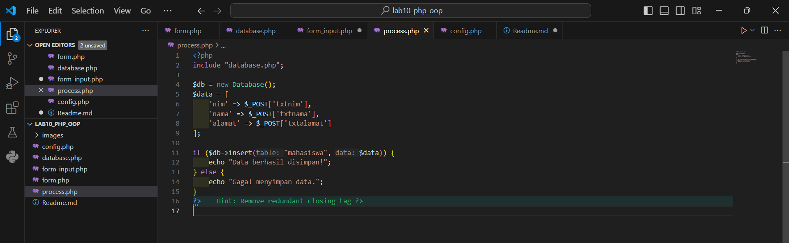

#### Membuat Database bernama users dan Buat tabel mahasiswa

# 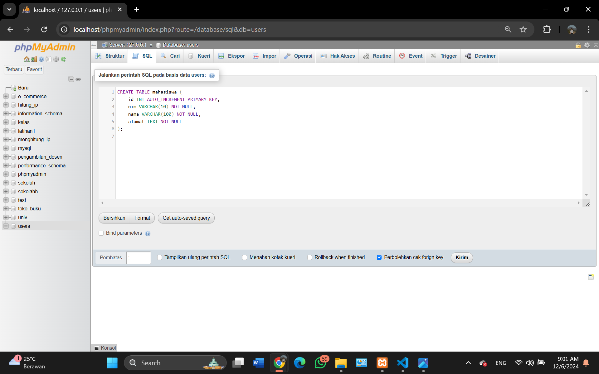

#### Buat file config.php di dalam folder lab10_php_oop

# 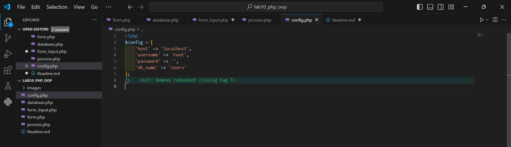

#### Buka browser dan akses http://localhost/lab10_php_oop/form_input.php, Formulir akan muncul dengan input NIM, Nama, dan Alamat.

# 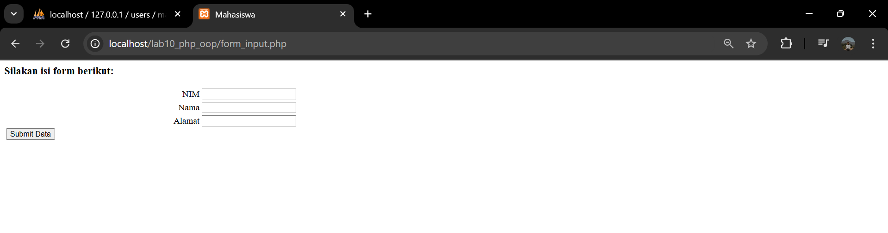

#### Masukkan data dan klik tombol Submit Data.

# 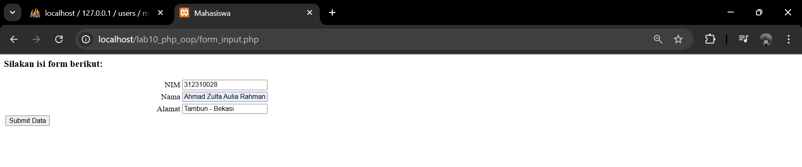

#### Setelah klik, browser akan diarahkan ke process.php. Jika berhasil, pesan "Data berhasil disimpan!" akan muncul.

# 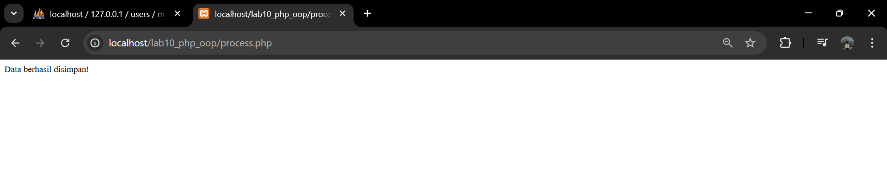

#### Buka phpmyadmin dan masuk ke database users pada table mahasiswa, data yang tadi di input otomatis tersimpan ke database users

# 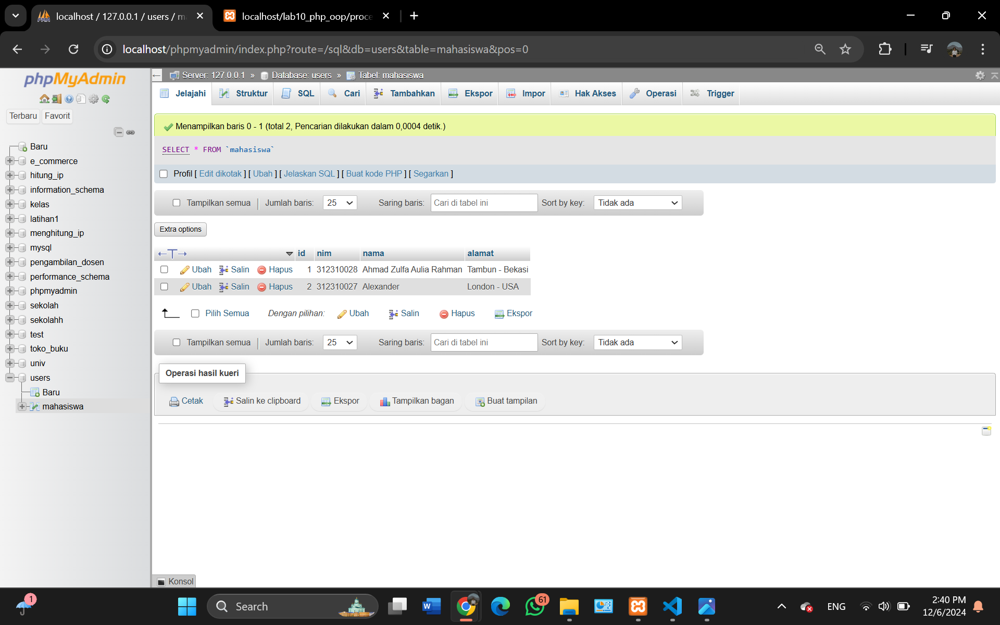
